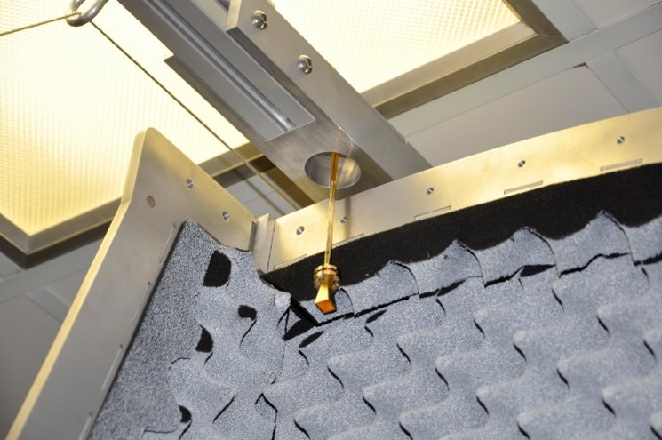
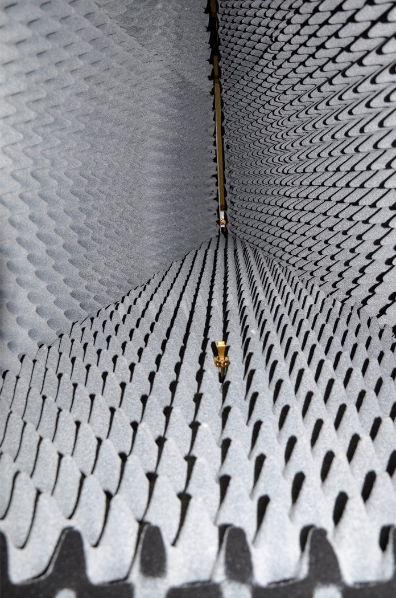
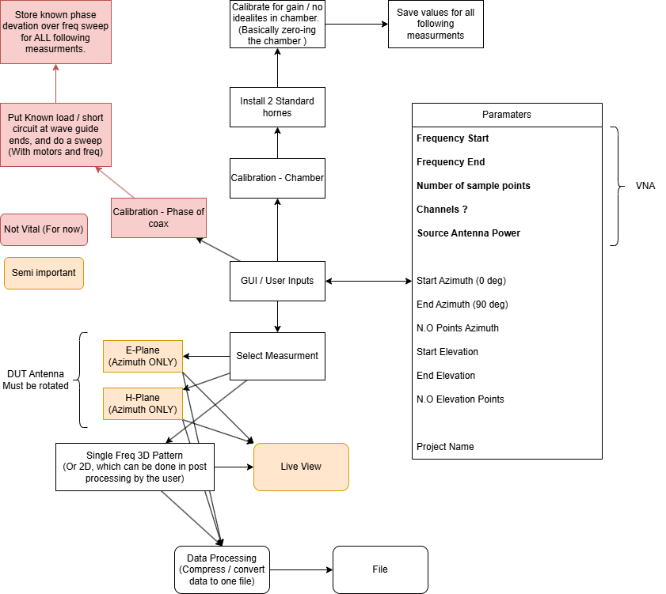
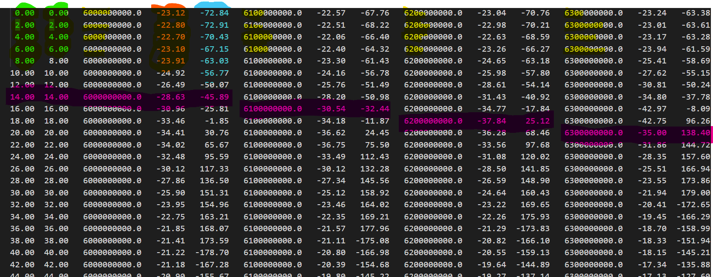
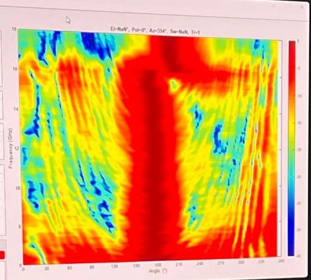

# Concept Planning
This document covers the planning, and general process of the anechoic chamber, and reasons for decisions. It will also cover the 

# Positioners and Wave Guides
There are two motors, Azimuth and Elevation. Depending on the orientation of the antennas, the azimuth plane can become polarization instead. The source antenna can be seen here:
 

 
And then the antenna under test:
 

 
With this original setup, and the DUT antenna (The one being tested) facing up right, instead elevation and azimuth is now being tested, as the DUT antenna will be rotated, changing the polarization in reference to the source. Therefore the antenna should instead stick up above the foam, and face horizontal, so the azimuth can be obtained. 
 

The frequency will be capped at 70 GHz for these tests, as attaching the frequency extenders are a project in their own regard. 

## Standard gain horn antennas available  
The two horns available are two [261V-15-385](https://www.miwv.com/v-band-standard-gain-horn-antennas-wr-15-50-75-ghz-2/) which is a max of 75 GHz, the patterns can also be found. **Note, this implies we will not be able to go above 75 GHz, unless an alternative feed antenna is found**.

# VNA 
SCPI Commands

# Results to be obtained
The general result, as formatted by SAAB shall be used. (#DR B)
This includes:
- **VSWR** against freq - This is typically measured outside the chamber, but it wont be hard to add a button for it, this will just be a $S_{22}$ parameter, and freq sweep. 
- **Realized Boresight gain (dBi)** against freq.
- **Normalized H-Plane Pattern** for one freq. 
- **Normalized H-Plane Pattern** for one freq. 
- **Normalized H-Plane Magnitude (dB)** against freq.
- **Normalized E-Plane Magnitude (dB)** against freq.

# GUI 
WIP - Will get one tomorrow. Trying to get a photo of **ANT Tester** from SAAB.   

# General flow of code
Please see the draw.io file. 
 

 

Code breakdown:
## Motors:
- Full scan code
- Azimuth only
- Elevation only
- Calibration code ? 

## SCPI / VNA
- Send settings / parameters
    - Freq Start
    - Freq End
    - Number of freq points
    - Averaging amount 
    - IF freq ? 
    - Channels ? 

- Other
    - Start / Trigger sweep of points
    - Collect / Download data from VNA -> PC
 
## GUI
- Set parameters
- Download data
- Perform calibration
    - Standard horn calab
    - Phase correction calab
    - Azimuth plane calab
    - Elevation boom calab

# File formatting
The files will contain the following data: 
    - Single Freq Data point {Yellow}  
    - Target Elevation [deg] {Green} 
    - Achieved Elevation (Should be the same) [deg] {Green} 
    - Measured gain {Orange} 
    - Measured phase {Blue} 
Note that the {Magenta} shows each sample for each freq point.  
Something like this:

 

 

The first several lines can contain data such as:

    - Date
    - Name of file
    - Number of Elevation points
    - Number of Azimuth Points
    - Freq Start
    - Freq End
    - Number of samples 

Might be best to make the **Tab** or **;** delimited.   
While the measurement is being taken, it might be good to add a live view:

 

 

This view, being a function of Freq (y) and angle of azimuth (x) and then the realized gain (Heat Map) shows a lot of quick information and any issues. This shows the general frequency response, the directivety, lobes, nulls, and in the case of this image leakage can be seen on the left, large lobes at lower frequencies, and near the end of the freq sweep there is a shift in the directivety, showing that the horn being measured is not symmetrical. This was a X-Band horn, hence 16 GHz is out of its operating range.  

